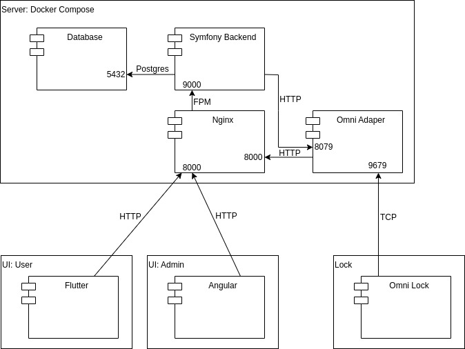
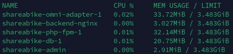
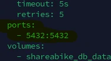
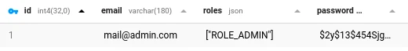
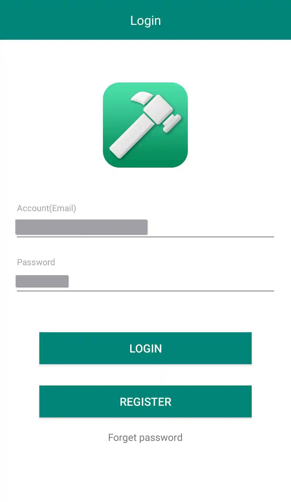
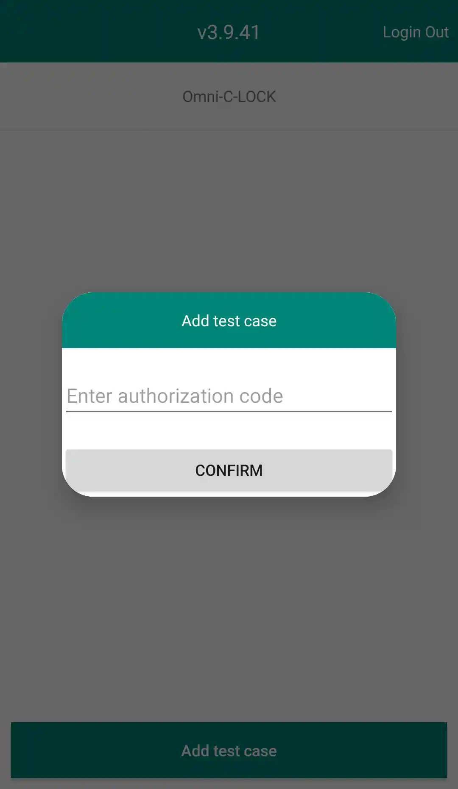
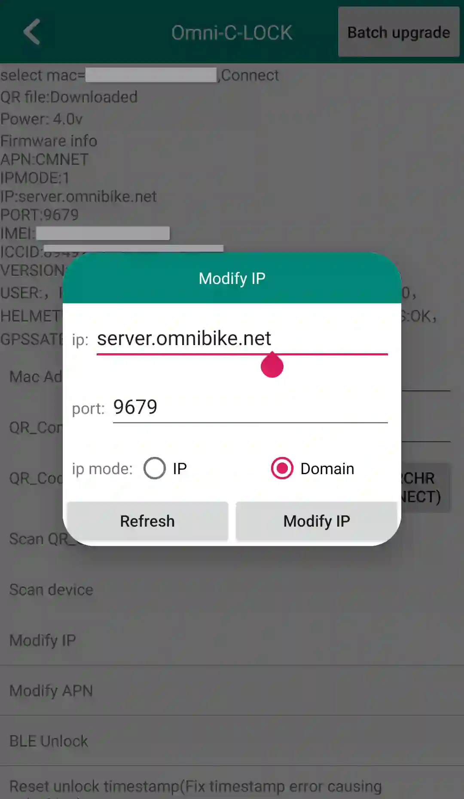

# ShareABike main repository

[Documentation Admin UI](https://github.com/Retch/shareabike-admin)
[Documentation Omni Adapter](https://github.com/Retch/shareabike-omni-lock-adapter)

- [Service schema](#service-schema)
- [Setup](#setup)
- [Add admin user](#add-admin-user)
- [Configure omni lock](#configure-omni-lock)
- [Api documentation](#api-documentation)

## Service schema

Use the docker-compose.yml file from this repository to configure and run the software stack.


## Setup

### System requirements

- Linux server
- Docker and Docker Compose

Depending on the amount of users and locks interacting with the system, you should have enough ram and cpu power available.
The following screenshot shows a test system with one lock and one admin user connected:



### With Docker

To run the software stack with docker, the only file needed is [docker-compose.yml](docker-compose.yml).
Configure the values to your needs.
The setup should work out of the box, but here is a list of values that are important to be changed.

#### Change values

- APP_SECRET: [Symfony documentation](https://symfony.com/doc/current/reference/configuration/framework.html#secret)
- ADAPTER_USERNAME: Username which is used by the adapter with basic auth to send data to the backend
- ADAPTER_PASSWORDHASH: Generate a secure hash with this [tool](https://bcyrpt.online) and your chosen adapter password
- CORS_ALLOW_ORIGIN: The url where your ui is hosted, to allow all origins (dev purposes) put in "*"
- BACKEND_USERNAME: Same as ADAPTER_USERNAME
- BACKEND_PASSWORD: The Password corresponding to the ADAPTER_PASSWORDHASH

#### Useful commands

##### Start

```bash
docker compose up -d
```

##### Stop

```bash
docker compose down
```

##### Logs

```bash
docker compose logs -f
```

##### Update

```bash
docker compose pull
```

#### Add admin user

You need to access the database to create an administrator account.
To access the db, use the _down_ command and add a port forwarding like this to the db part in the _docker-compose.yml_ file:



Now you can access the db directly or via ssh with your favorite database tool.
Insert an entry to table _user_ with roles column like following and a hash ([bcrypt.online](https://bcrypt.online/)).



## Configure omni lock

Lock configuration is done via an app called _BleTool_.
First insert the sim card.
You have to modify the server domain/ip (omni adapter host) and APN for the sim card network to work.
A test case code is needed to add a test case
You can request the app apk and a test case from omni support.

### Visualization

#### BleTool


#### Login



#### Test case



#### Set omni adapter host



## Api Documentation

For better understanding, all api routes come with sample data. Values in [] are placeholder.

### Adapter

#### Update Status

The adapter sends data to the backend via the adapter endpoint. Only values that changed are sent from the adapter to the backend. All values are optional.

##### Request

```bash
curl -u [ADAPTER_BACKEND_USER]:[ADAPTER_BACKEND_PASSWORD] --location 'http://[BACKEND_HOST]/adapter/[IMEI]/updatestatus' \
--header 'Content-Type: application/json' \
--data '{
    "packetType": "S5Packet",
    "voltage": 4.02,
    "isLocked": false,
    "csq": 27,
    "satellites": 8,
    "noGps": false,
    "hdop": 1.5,
    "altitude": 259.2,
    "longitudeHemisphere": "N",
    "latitudeHemisphere": "E",
    "longitudeDegrees": 11.038,
    "latitudeDegrees": 50.963,
    "btMac": "D3:D3:62:AA:11:11",
    "lockSwVersion": "124",
    "lockHwRevision": "C9",
    "lockSwDate": "2022-06-20",
    "event": "recovery"
}'
```

##### Response

Status codes:

- 200: Data was successfully received
- 401: Probably username or password not correct
- 404: Probably lock with given IMEI does not exist in backend database

### Auth

The backend uses jwt auth with refresh token in cookie.

#### Login

##### Request

```bash
curl --location 'http://[BACKEND_HOST]/api/login_check' \
--header 'Content-Type: application/json' \
--data-raw '{
    "username": [USER_EMAIL],
    "password": [USER_PASSWORD]
}'
```

##### Response

If successful, a jwt will be returned in the body and the refresh token will be contained in a cookie called refresh_token.

#### Check jwt

To check the validity of a jwt. Jwt validity period can be adjusted in the compose.

##### Request

```bash
curl --location 'http://[BACKEND_HOST]/api/jwt_check' \
--header 'Authorization: Bearer [JWT]'
```

##### Response

Status codes:

- 200: jwt is valid
- 401: jwt is invalid

#### Refresh

Because of security reasons, the jwt has a very limited validity time period. For that reason, a new jwt has to be requested with passing the previously received refresh_token cookie.

##### Request

```bash
curl --location 'http://[BACKEND_HOST]/api/token/refresh' \
--header 'Cookie: refresh_token=[REFRESH_TOKEN_COOKIE]'
```

##### Response

If successful, a new jwt will be returned in the body.

#### Logout

The refresh_token cookie has to be sent along, so it can be invalidated and the user logged out. Remember to remove the jwt from the frontend application also.

##### Request

```bash
curl --location 'http://[BACKEND_HOST]/api/token/invalidate' \
--header 'Cookie: refresh_token=[REFRESH_TOKEN_COOKIE]'
```

##### Response

If successful, http 200 will be returned.

### Admin

#### Get All Locks

##### Request

```bash
curl --location 'http://[BACKEND_HOST]/api/admin/locks' \
--header 'Authorization: Bearer [JWT]'
```

##### Response

Array of locks

```json
{
    "locks": [
        {
            "id": 1,
            "deviceId": "123456789",
            "qrCodeContent": "123456",
            "isLocked": true,
            "lockTypeDescription": "omni",
            "isConnectedToAdapter": true,
            "lastEvent": null,
            "lastEventUtcTimestamp": null,
            "lastContactUtcTimestamp": 1693299451,
            "batteryPercentage": 76,
            "cellularSignalQualityPercentage": 51,
            "noGps": false,
            "lastPositionTimeUtcTimestamp": 1693228697,
            "satellites": 8,
            "hdop": 1,
            "latitudeDegrees": 50.964,
            "longitudeDegrees": 11.048,
            "latitudeHemisphere": "N",
            "longitudeHemisphere": "E"
        }
    ]
}
```

#### Get All Lock types

##### Request

```bash
curl --location 'http://[BACKEND_HOST]/api/admin/locktypes' \
--header 'Authorization: Bearer [JWT]'
```

##### Response

Array of lock types

```json
{
    "lockTypes": [
        {
            "id": 1,
            "description": "omni",
            "batteryVoltageMin": 3.4,
            "batteryVoltageMax": 4.2,
            "cellularSignalQualityMin": 2,
            "cellularSignalQualityMax": 32
        }
    ]
}
```

#### Add lock

##### Request

```bash
curl --location 'http://[BACKEND_HOST]/api/admin/lock' \
--header 'Authorization: Bearer [JWT]' \
--header 'Content-Type: application/json' \
--data '{
    "deviceId": "123456789",
    "qrCodeContent": "123456",
    "lockTypeId": 1
}'
```

##### Response

Status codes:

- 200: Lock added successfully
- 409: Lock with lock id already exists

#### Add Lock Type

With a fresh setup and a clean database, you have to define the lock type. At the moment, only omni locks are supported, so the table will only have one lock type entry.<br />
!Important: When adding a lock type "family" and the lock type you want to add is from brand omni lock or follows the protocol, be sure to use "omni" as description string because some lock specific functions as unlocking are specific to the lock type. The backend will check the lock type description and when it contains "omni" the omni specific functions are going to work.

##### Request

```bash
curl --location 'http://[BACKEND_HOST]/api/admin/locktype' \
--header 'Authorization: Bearer [JWT]' \
--header 'Content-Type: application/json' \
--data '{
    "description": "omni",
    "batteryVoltageMin": 3.4,
    "batteryVoltageMax": 4.2,
    "cellularSignalQualityMin": 2,
    "cellularSignalQualityMax": 32
}'
```

##### Response

Status codes:

- 200: Lock type added successfully
- 409: Lock type with description already exists

#### Unlock lock

##### Request

```bash
curl --location 'http://[BACKEND_HOST]/api/admin/requestunlock/[LOCKID]' \
--header 'Authorization: Bearer [JWT]'
```

##### Response

Status codes:

- 200: Lock should unlock now
- 500: Probably lock id not exist
- 501: Adapter type unlock not implemented in backend

#### Trigger lock beep

##### Request

```bash
curl --location 'http://[BACKEND_HOST]/api/admin/requestring/[LOCKID]' \
--header 'Authorization: Bearer [JWT]'
```

##### Response

Status codes:

- 200: Lock should beep now
- 500: Probably lock id not exist
- 501: Adapter type ring not implemented in backend

#### Ask lock gps position information

##### Request

```bash
curl --location 'http://[BACKEND_HOST]/api/admin/requestposition/[LOCKID]' \
--header 'Authorization: Bearer [JWT]'
```

##### Response

Status codes:

- 200: Lock should fetch gps position and send it back a few minutes later
- 500: Probably lock id not exist
- 501: Adapter type ask position not implemented in backend

#### Ask lock general information

##### Request

```bash
curl --location 'http://[BACKEND_HOST]/api/admin/requestinfo/[LOCKID]' \
--header 'Authorization: Bearer [JWT]'
```

##### Response

Status codes:

- 200: Lock should fetch general information and send it back shortly
- 500: Probably lock id not exist
- 501: Adapter type ask information not implemented in backend

### User

To be implemented
