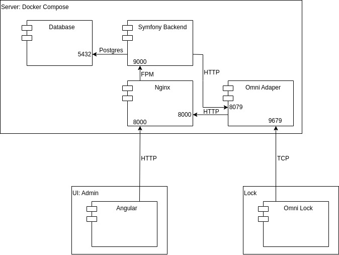

# ShareABike

## Service Setup Schema
Use the docker-compose.yml file from this repository to configure and run the software stack.

## Api Documentation
### Adapter
### Client
#### Admin
#### User
